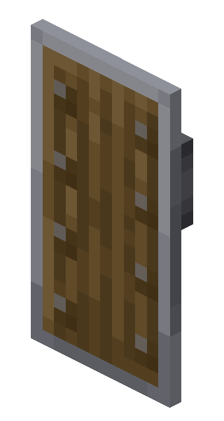
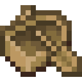

#  Lava Boat Clutch Fix
> Restores the "lava boat clutch" mechanic which was removed in Minecraft 1.21.5

---

In Minecraft 1.21.5, Mojang fixed the bug that allowed boats to briefly survive on lava — the mechanic behind the legendary **lava boat clutch** (famously used by **Dream** in **Manhunt**).

This mod restores it. When a boat first touches lava, it receives a short immunity window so the player can land on the hitbox and survive the fall — exactly like in older versions.

**Now you can do lava boat clutches in modern Minecraft!**

## Supported Platforms

Lava Boat Clutch Fix is currently available for Fabric, Quilt or NeoForge on Minecraft: Java Edition 1.21.5 or newer.

## Two Editions

This mod comes in three editions, so you can pick the one that fits your setup:

## Regular edition

The full experience with an in-game config screen.
-  **Lava immunity** — boats survive on lava for a configurable number of ticks (default: 3)
-  **Fire damage protection** — no fire damage to the boat during the immunity window
-  **Item drop bounce** — the dropped boat item bounces upward out of the lava so it doesn't burn (default: vanilla)
-  **No fire flicker** — fire particles are suppressed on the client for the first 4 ticks
-  **Toggle on/off** — disable the mod at any time without removing it (default: enable mod)
- ⚙️ **Fully configurable** — adjust everything via the in-game config screen (requires Cloth Config + Mod Menu)
- 🌐 **Localized** — this mod version supports a lot of languages!
> Dependencies: on Fabric/Quilt the config screen requires Cloth Config + Mod Menu, on NeoForge the config screen is built in - no dependencies.

**
Also available: a "lightweight regular edition" — same mod, same config, just without the extra translations, so the file size is smaller.**

## Raw edition

The exact same mechanic with zero dependencies and zero config.
-  **Lava immunity** — boats survive on lava for a configurable number of ticks
-  **Fire damage protection** — no fire damage to the boat during the immunity window
-  **Item drop bounce** — the dropped boat item bounces upward out of the lava so it doesn't burn
-  **No fire flicker** — fire particles are suppressed on the client for the first 4 ticks
- 🪶 **Zero dependencies** — no Cloth Config, no Mod Menu required
> If you want to change any of the config values, use the regular edition instead.
---

## Configuration (regular edition)

Open the config screen via Mod Menu → Lava Boat Clutch Fix → Config (Fabric/Quilt) or Mods → Lava Boat Clutch Fix → Config (NeoForge)

| Option | Default | Description |
|---|---|---|
| `Enable Mod` | `true` | Toggle the entire mod on/off |
| `Immunity Ticks` | `3` | How many ticks the boat is protected on first lava contact |
| `Bounce Mode` | `Vanilla` | `Vanilla` — vanilla behavior; `Custom` — custom X/Y/Z velocity; 
`Random` - random  X/Y/Z velocity
|
| `Bounce Y` | `0.0` | Upward velocity of the dropped item (Custom mode) |
| `Bounce X/Z` | `0.0` | Horizontal velocity of the dropped item (Custom mode) |

---

## Gratitude

Special thanks to:

- [Minecraft Curios Animations](https://www.youtube.com/@MinecraftCuriosAnimations) for mod image.
- [ClaudeAI](https://claude.com) for helping me :)

---

## Support me

- Subscribe to my [youtube](https://www.youtube.com/@IAmGurich)
- Send [donation](https://dalink.to/iamgurich)
